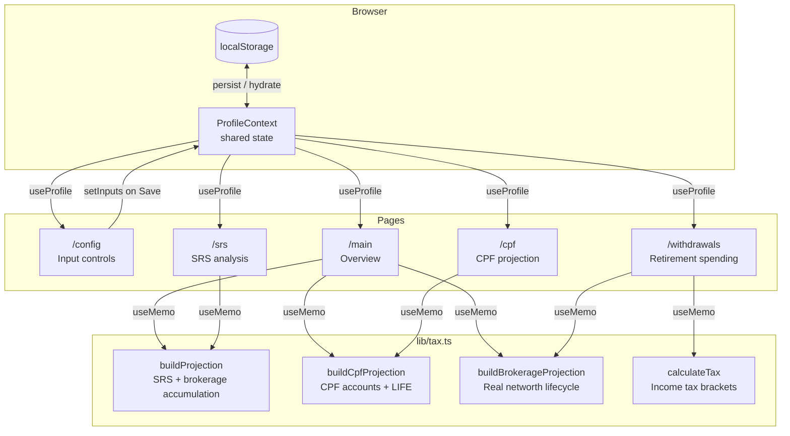

# Singapore Retirement Dashboard

> An interactive, browser-based retirement planner purpose-built for Singapore residents — models CPF, SRS, and personal brokerage accounts together across your entire working life and retirement.


## What is this?

Retirement planning in Singapore is complicated. You have three parallel "pots" that all follow different rules: the **Central Provident Fund (CPF)** with its four sub-accounts, age-band contribution ratios, and mandatory annuity conversion; the **Supplementary Retirement Scheme (SRS)**, a voluntary tax-sheltered account with a 10-year withdrawal window; and a **personal brokerage account** that fills in the gaps. No mainstream calculator handles all three together.

This dashboard solves that by running a year-by-year simulation from your current age to your projected death age. Every year it computes your CPF contributions (using the actual CPF Board allocation bands), your SRS tax savings, and your brokerage surplus — then shows you whether your income sources will cover your inflation-adjusted expenses in retirement.

The goal is a single screen that answers the question: *"Am I on track, and what does each decision actually cost me in the long run?"*

## Key Innovations

### Age-banded CPF allocation ratios
The CPF Board uses five distinct OA/SA/MA allocation bands (≤35, ≤45, ≤50, ≤55, >55) — and the ratios shift significantly as you age (younger workers get more OA; older workers get more SA). The simulation re-evaluates `allocateCpfContribution(age, contribution)` at each calendar year, so every projection year uses the correct statutory split rather than a fixed approximation. This matters most around ages 45–55 where SA contributions surge ahead of the RA conversion.

### Two-phase investment growth rate
Rather than a single return assumption across 60 years, the model switches from a configurable "accumulation rate" (default 7%) to a separate "post-retirement rate" (default 2.5%) at the exact year you stop working. This reflects the realistic shift from equity-heavy to capital-preservation portfolios and prevents the overly optimistic compounding that single-rate models produce. The switch is applied uniformly to the SRS pot, personal brokerage, and CPF balances.

### Three-phase brokerage drawdown logic
The personal brokerage account passes through three distinct phases: (1) **accumulation** — annual surplus from take-home after SRS, tax, and living expenses is deposited each year; (2) **drawdown** — between `stopWorkingAge` and `srsWithdrawalAge`, the brokerage covers any shortfall not met by CPF LIFE; (3) **reinvestment** — after SRS withdrawals begin, any surplus from CPF LIFE + SRS income over inflation-adjusted expenses is reinvested and continues compounding. This means a well-funded plan can actually *grow* its brokerage balance in retirement rather than continuously depleting it.

### OA-to-brokerage transfer at retirement age
At `cpfRetirementAge`, the model converts the full Ordinary Account balance into the real networth account in a single step and simultaneously zeros OA in the CPF chart — preventing double-counting in the net-worth total. On the CPF chart, the OA area drops to zero at that reference line while the brokerage chart shows the corresponding spike. The SA→RA conversion happens in the same year, covering any shortfall from OA if SA alone can't meet the Full Retirement Sum target.

### SRS 50% taxable fraction modeled explicitly
SRS withdrawals are only 50% taxable under Singapore law. The model applies this fraction when computing the annual tax drag during the 10-year SRS withdrawal window, which meaningfully affects post-tax take-home — and correctly shows that SRS becomes more advantageous the higher your marginal rate during accumulation relative to your (likely lower) retirement income.

### Salary cascade on manual override
The config page maintains a `salarySeries` array — one gross salary value per working year. When you edit a cell at index `i`, every subsequent row is auto-updated as `newGross × (1 + growthRate)^(j − i)`. This lets you model a specific career arc (big early promotion, sabbatical, founder-mode income dip) without manually editing every future year. Switching back to the formula is a single "Reset to defaults" button.

### Column visibility toggle with per-column dropdown
Both the SRS and CPF projection tables have a header-click dropdown per column offering "Hide column" / "Remove from hidden" — and a global "show hidden" toggle that reveals them at reduced opacity. The default hidden sets (tax columns in SRS; raw balance columns in CPF) keep the tables scannable without removing the data entirely. The pattern lives in shared `hiddenCols: Set<ColId>` state and is easy to replicate on any new page.

## Architecture



**`lib/tax.ts`** is the entire financial brain — pure functions, no side effects, easily unit-testable.

**`lib/profile-context.tsx`** is the single source of truth for user inputs. Every page reads from it; only Config writes to it (on explicit Save).

**Pages** are pure views: read inputs, call `useMemo` to run projections, render charts and tables. No financial logic lives in components.

## Tech Stack

| Layer | Technology | Purpose |
|---|---|---|
| Framework | Next.js 16 (App Router) | Routing, SSR, build pipeline |
| UI | React 19 | Component model |
| Styling | Tailwind CSS v4 | Utility-first design, dark-mode class toggle |
| Charts | Recharts 3 | LineChart, AreaChart, reference lines, tooltips |
| State | React Context + localStorage | Shared profile inputs, persistence |
| Language | TypeScript 5 | Type safety across financial models |
| Linting | ESLint 9 (eslint-config-next) | Code quality |

## Features

- **Overview dashboard** — net worth breakdown (CPF + SRS + Brokerage) and real networth balance from today to death age, with KPI cards for peak net worth, balance at death, and OA transfer amount
- **SRS analysis page** — side-by-side with-SRS vs. without-SRS projection with total tax savings quantified; SRS withdrawal breakdown showing pot → annual income → tax → net take-home
- **CPF projection page** — stacked area chart of OA/SA/MA/RA balances; highlights SA→RA conversion and CPF LIFE purchase; shows whether you'll meet the Full Retirement Sum target
- **Retirement spending page** — year-by-year table from retirement to death showing inflation-adjusted expenses vs. CPF LIFE + SRS + brokerage income; green/red shortfall column
- **Salary projection editor** — editable year-by-year salary table with cascade-on-edit; override any year without losing the growth-rate model for subsequent years
- **Dual investment growth rates** — separate sliders for accumulation phase and post-retirement phase
- **Configurable age milestones** — stop-working age, CPF retirement age, SRS withdrawal age, CPF withdrawal age, death age all independently adjustable
- **Column visibility toggles** on SRS and CPF tables — hide/show individual columns per-column or globally
- **Dark/light theme** — toggled in the navbar, persisted to localStorage, SSR-safe with `suppressHydrationWarning`
- **Privacy-first** — all computation is client-side; no data leaves your browser

## Financial Assumptions

This tool uses the following statutory constants (accurate as of 2024/2025):

| Constant | Value | Source |
|---|---|---|
| SRS annual cap (citizen) | S$15,300 | IRAS |
| CPF employee contribution rate | 20% | CPF Board |
| CPF total rate (employee + employer) | 37% | CPF Board |
| OA interest rate | 2.5% p.a. | CPF Board |
| SA / MA / RA interest rate | 4.0% p.a. | CPF Board |
| SRS taxable fraction on withdrawal | 50% | IRAS |
| SRS withdrawal window | 10 years | IRAS |
| FRS inflation rate | 2% p.a. | CPF Board (assumed) |
| Expense inflation | 2% p.a. | Model assumption |
| Default monthly expenses | S$4,000 | Model assumption |

> **Disclaimer:** This tool is for illustrative purposes only and does not constitute financial advice. CPF rates, tax brackets, and SRS rules are subject to change. Consult a licensed financial adviser before making retirement decisions.

## Roadmap

### HDB via Ordinary Account
For most Singaporeans, property is the single largest asset — yet it currently lives outside the model. The next major addition is an HDB module: mortgage drawdown from OA during the working years (reducing the OA balance available for RA conversion), a projected property valuation over time, and a toggle for whether you intend to monetise the flat in retirement (lease buyback, downgrade proceeds). This requires threading OA consumption back through `buildCpfProjection` so the SA→RA conversion accounts for the reduced OA balance correctly.

### Live net worth from banks and brokerages
All inputs today are manually keyed. A future integration layer would pull real balances automatically — SGFinDex (Singapore's national financial data exchange, already adopted by major local banks and brokerages) provides a standardised API for exactly this. Connecting to SGFinDex would let the dashboard replace your manually entered starting balances with live figures on each visit, reducing the "garbage in, garbage out" risk of stale inputs.

### Multi-asset brokerage with per-asset growth rates
The current model treats the real networth account as a single blended pot. The planned replacement is a **multi-component portfolio**:

| Asset class | Examples | Rate of return |
|---|---|---|
| Cash / short-term reserves | Bank HYSA, T-bills, fixed deposits | Configurable (e.g. 3.5%) |
| Equities | STI ETF, global index funds, individual stocks | Configurable (e.g. 7–9%) |
| Alternative assets | Gold, silver, precious metals | Configurable (e.g. 3–5%) |
| Digital assets | Bitcoin, Ethereum, other crypto | Configurable (e.g. high-variance) |

Each component has its own starting balance, annual contribution, and growth rate. The aggregate net worth calculation sums them; charts can show each asset class as a separate series or stacked. This unlocks realistic portfolio allocation modelling — e.g. "what if I hold 6 months of expenses in cash, 80% in equities, and 5% in gold?"

### Medisave for insurance premiums
MediShield Life, Integrated Shield Plans, and CareShield Life all draw from Medisave (MA). The current model grows MA untouched, which overestimates the MA balance available for healthcare costs in retirement. The planned addition tracks annual premium withdrawals from MA by policy type, adjusts the MA balance accordingly each year, and projects whether MA remains sufficient to self-fund premiums through retirement or whether top-ups from cash are needed.

### Medisave for one-time medical expenses
Beyond regular premiums, large hospitalisations (surgery, cancer treatment, long-term care) can draw significantly from MA. A future **medical event planner** would let you model specific expected or worst-case medical expenses — scheduled surgeries, chronic condition management — as dated one-time MA withdrawals. Paired with the CPF MA balance projection, this answers: *"Will my Medisave last, and what's my out-of-pocket exposure if it doesn't?"*

## Getting Started

### Prerequisites

| Tool | Version | Install |
|---|---|---|
| Node.js | 18.x or later | [nodejs.org](https://nodejs.org) |
| npm | bundled with Node.js | — |

### 1. Clone the repository

```bash
git clone https://github.com/GeneralR3d/retirement_dashboard.git
cd retirement_dashboard
```

### 2. Install dependencies

```bash
npm install
```

*This pulls Next.js, React, Tailwind, Recharts, and all dev dependencies.*

### 3. Start the development server

```bash
npm run dev
```

Open [http://localhost:3000](http://localhost:3000) in your browser. You'll be redirected to `/main` automatically.

### 4. Enter your profile

Navigate to **Config** (top-right in the nav). Fill in your:
- Age milestones (current age, when you plan to stop working, etc.)
- Starting salary and growth rate
- CPF account balances (find these in your CPF statement)
- Investment growth rate assumptions
- Living expense percentage

Click **Save** — all other pages update instantly.

## Development

```bash
npm run dev       # Start dev server at http://localhost:3000
npm run build     # Production build (also runs TypeScript checking)
npm run lint      # ESLint
npx tsc --noEmit  # Type-check without building
```

There is no test suite. Financial logic lives entirely in `lib/tax.ts` — it's pure functions and straightforward to unit-test if you want to add one.

## Project Structure

```
app/
├── layout.tsx              # Root layout — mounts ProfileProvider, Navbar
├── page.tsx                # Redirect → /main
├── globals.css             # Tailwind v4 config, CSS theme variables
├── main/page.tsx           # Overview dashboard
├── srs/page.tsx            # SRS projection & comparison
├── cpf/page.tsx            # CPF projection
├── withdrawals/page.tsx    # Retirement spending table
├── config/page.tsx       # Input controls & salary editor
└── components/
    ├── ui.tsx              # Shared: Slider, NumberField, StatCard, Th, Td
    └── navbar.tsx          # Nav links + dark/light toggle
lib/
├── tax.ts                  # All financial modeling (pure functions)
├── profile-context.tsx     # Shared React Context + localStorage persistence
└── format.ts               # Currency formatting (en-SG locale)
```

### Adding a new analysis page

1. Create `app/<name>/page.tsx`
2. Read inputs with `const { inputs } = useProfile()`
3. Run projections in `useMemo` using functions from `lib/tax.ts`
4. Add the route to `NAV_LINKS` in `app/components/navbar.tsx`
5. Keep all financial logic in `lib/` — pages are views only

## License

MIT © 2025 GeneralR3d
